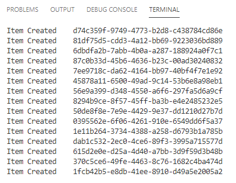

# .NET SDK を使用したパーティション化されたコンテナーの作成

このラボでは、さまざまなパーティションキーと設定を使用して、複数の Azure Cosmos DB コンテナーを作成します。その後のラボでは、SQL API と .NET SDK を使用して、単一のパーティションキーまたは複数のパーティションキーを使用して特定のコンテナにクエリを実行します。

> ラボコンテンツのセットアップをまだ完了していない場合は、このラボを開始する前に [アカウントのセットアップ](00-account_setup.md) の説明を参照してください。

## .NET SDK を使用したコンテナーの作成

まず、.NET SDK を使用して、これ以降のラボで使用するコンテナーを作成します。

### .NET Core プロジェクトの作成

1. ローカルマシンで、**CosmosLabs** フォルダ内の **Documents** フォルダーを見つけます。
1. .NET Core プロジェクトのコンテンツを含めるために使用する **Lab01** フォルダーを開きます。

   - もしこのフォルダーがない場合は、あなたは [アカウントのセットアップ](00-account_setup.md) の手順で `labCodeSetup.ps1` スクリプトを実行していません。

   - Microsoft ハンズオンラボを通じてこのラボを完了する場合、CosmosLabs フォルダーは次のパスに配置されます: **C:\labs\CosmosLabs**

1. **Lab01** フォルダーでフォルダーを右クリックし、**Code で開く** メニューオプションを選択します。

    

    > または、現在のディレクトリでターミナルを実行して、`code .` コマンドを実行することもできます。

1. 表示される Visual Studio Code ウィンドウで、**エクスプローラー** ペインを右クリックし、**統合ターミナルで開く** メニューオプションを選択します。

    

1. 開いているターミナルペインで、次のコマンドを入力して実行します:

    ```sh
    dotnet new console --output .
    ```

    > このコマンドは、新しい .NET Core プロジェクトを作成します。プロジェクトは **コンソール** プロジェクトになり、`--output .` オプションを使用したため、プロジェクトは現在のディレクトリーに直接作成されます。

1. Visual Studio Code は、おそらく **.NET Core** または **Azure Cosmos DB** 開発に関連するさまざまな拡張機能をインストールするように要求してきます。ラボを完了するためにこれらの拡張機能は必要ありません。

1. ターミナルペインで、次のコマンドを入力して実行します:

    ```sh
    dotnet add package Microsoft.Azure.Cosmos --version 3.12.0
    ```

    > このコマンドは、[Microsoft.Azure.Cosmos](https://www.nuget.org/packages/Microsoft.Azure.Cosmos/) NuGet パッケージをプロジェクトの依存関係として追加します。ラボの手順は、この NuGet パッケージの `3.12.0` バージョンを使用してテストされています。

1. ターミナルペインで、次のコマンドを入力して実行します:

    ```sh
    dotnet add package Bogus --version 30.0.2
    ```

    > このコマンドは、[Bogus](../media/https://www.nuget.org/packages/Bogus/) NuGet パッケージをプロジェクトの依存関係として追加します。このライブラリを使用すると、流暢な構文と最小限のコードを使用してテストデータをすばやく生成することができます。このライブラリを使用して、Azure Cosmos DB インスタンスにアップロードするテストドキュメントを生成します。ラボの手順は、この NuGet パッケージの `22.0.8` バージョンを使用してテストされています。

1. ターミナルペインで、次のコマンドを入力して実行します:

    ```sh
    dotnet restore
    ```

    > このコマンドは、プロジェクトで依存関係として指定されたすべてのパッケージを復元します。

1. ターミナルペインで、次のコマンドを入力して実行します:

    ```sh
    dotnet build
    ```

    > このコマンドはプロジェクトをビルドします。

1. **🗙** 記号を選択して、ターミナルペインを閉じます。

1. .NET Core CLI によって作成された **Program.cs** ファイルと **[ フォルダ名 ].csproj** ファイルを確認します。

    

1. **エクスプローラー** ペインで **[ フォルダ名 ].csproj** ファイルを選択し、エディターでファイルを開きます。

1. ここで、 **Project** 要素内のプロジェクト構成に新しい **PropertyGroup** XML要素を追加します。新しい **PropertyGroup** を追加するには、`<Project Sdk="Microsoft.NET.Sdk">` という行の下に次のコード行を挿入します:

    ```xml
    <PropertyGroup>
        <LangVersion>latest</LangVersion>
    </PropertyGroup>
    ```

1. 新しい XML は次のようになります:

    ```xml
    <Project Sdk="Microsoft.NET.Sdk">
        <PropertyGroup>
            <LangVersion>latest</LangVersion>
        </PropertyGroup>
        <PropertyGroup>
            <OutputType>Exe</OutputType>
            <TargetFramework>netcoreapp3.1</TargetFramework>
        </PropertyGroup>
        <ItemGroup>
            <PackageReference Include="Bogus" Version="30.0.2" />
            <PackageReference Include="Microsoft.Azure.Cosmos" Version="3.12.0" />
        </ItemGroup>
    </Project>
    ```

1. **エクスプローラー** ペインで **Program.cs** ファイルを選択して、エディターでファイルを開きます。

    

### Create インスタンスを作成

CosmosClient クラスは、Azure Cosmos DB で SQL API を使用するための主要な「入り口」です。クラスのコンストラクターのパラメーターとして接続メタデータを渡し、**CosmosClient** クラスのインスタンスを作成します。その後、このクラスインスタンスをラボ全体で使用します。

1. **Program.cs** エディタータブ内で、次の using ブロックをエディターの上部に追加します:

    ```csharp
    using System.Collections.Generic;
    using System.Threading.Tasks;
    using Microsoft.Azure.Cosmos;
    ```

1. **Program** クラスを見つけて、次のクラスに置き換えます:

    ```csharp
    public class Program
    {
        public static async Task Main(string[] args)
        {
        }
    }
    ```

1. **Program** クラス内に次のコード行を追加して、接続情報の変数を作成します:

    ```csharp
    private static readonly string _endpointUri = "";
    private static readonly string _primaryKey = "";
    ```

1. `_endpointUri` 変数については、プレースホルダー値を Azure Cosmos DB アカウントの **URI** 値に置き換えます。

    > たとえば、**uri** が `https://cosmosacct.documents.azure.com:443/`　の場合、新しい変数の割り当ては次のようになります: `private static readonly string _endpointUri = "https://cosmosacct.documents.azure.com:443/";`

1. `_primaryKey` 変数については、プレースホルダー値を Azure Cosmos DB アカウントの **PRIMARY KEY** 値に置き換えます。

    > たとえば、**primary key** が `elzirrKCnXlacvh1CRAnQdYVbVLspmYHQyYrhx0PltHi8wn5lHVHFnd1Xm3ad5cn4TUcH4U0MSeHsVykkFPHpQ==` の場合、新しい変数の割り当ては次のようになります: `private static readonly string _primaryKey = "elzirrKCnXlacvh1CRAnQdYVbVLspmYHQyYrhx0PltHi8wn5lHVHFnd1Xm3ad5cn4TUcH4U0MSeHsVykkFPHpQ==";`.

    > **URI** と **PRIMARY KEY** の値を記録しておいてください。後でこのラボで再度使用します。

1. **Main** メソッドを見つけます:

    ```csharp
    public static async Task Main(string[] args)
    {
    }
    ```

1. **Main** メソッド内に次のコード行を追加して、**CosmosClient** インスタンスを作成して破棄する using 文を作成します:

    ```csharp
    using CosmosClient client = new CosmosClient(_endpointUri, _primaryKey);
    ```

1. あなたの `Program` クラス定義は次のようになります:

    ```csharp
    public class Program
    {
        private static readonly string _endpointUri = "<your uri>";
        private static readonly string _primaryKey = "<your key>";

        public static async Task Main(string[] args)
        {
            using CosmosClient client = new CosmosClient(_endpointUri, _primaryKey);
        }
    }
    ```

    > アプリケーションのビルドを実行して、コードが正常にコンパイルされることを確認します。

1. 開いているすべてのエディタータブを保存します。

1. 開いているターミナルペインで、次のコマンドを入力して実行します:

    ```sh
    dotnet build
    ```

    > このコマンドはコンソールプロジェクトをビルドします。エラーがないことを確認してください。

1. **🗙** 記号を選択して、ターミナルペインを閉じます。

1. 開いているすべてのエディタータブを閉じます。

### SDK を使用したデータベースの作成

1. **Main** メソッドの下に新しいメソッドを作成します:

```csharp
    private static async Task<Database> InitializeDatabase(CosmosClient client, string databaseId)
    {
        DatabaseResponse databaseResponse = await client.CreateDatabaseIfNotExistsAsync(databaseId);
        Database targetDatabase = databaseResponse.Database;
        await Console.Out.WriteLineAsync($"Database Id:\t{targetDatabase.Id}");
        return targetDatabase;
    }
```

> このコードは、渡された名前でデータベースが Azure Cosmos DB アカウントに存在するかどうかを確認します。 一致するデータベースが存在しない場合は、新しいデータベースを作成して返します。

1. **Main** メソッド内で using ブロックを見つけます:

    ```csharp
    using CosmosClient client = new CosmosClient(_endpointUri, _primaryKey);
    ```

1. メソッドに次のコードを追加して、新しい `Database` インスタンスがまだ存在しない場合は作成します:

    ```csharp
    Database database = await InitializeDatabase(client, "EntertainmentDatabase");
    ```

1. 開いているすべてのエディタータブを保存します。

1. 開いているターミナルペインで、次のコマンドを入力して実行します:

    ```sh
    dotnet run
    ```

    > 実行中のコマンドの出力を確認します。 コンソールウィンドウに、Azure Cosmos DB アカウントのデータベースリソースの ID 文字列が表示されます。

1. **🗙** 記号を選択して、ターミナルペインを閉じます。

### SDK を使用してパーティション化されたコンテナーを作成

コンテナーを作成するには、名前とパーティションキーのパスを指定する必要があります。このタスクでコンテナーを作成するときに、これらの値を指定します。パーティションキーは、スケールアウトされた物理パーティションのセットにデータを分散し、クエリを適切なパーティションに効率的にルーティングするための論理的なヒントです。詳細については、[/docs.microsoft.com/azure/cosmos-db/partition-data](https://docs.microsoft.com/ja-jp/azure/cosmos-db/partition-data) を参照してください。

1. **InitializeDatabase()** メソッドの下に、次の新しいメソッドを作成します:

```csharp
    private static async Task<Database> InitializeContainer(Database database, string containerId)
    {

    }
```

1. 次のコードを追加して、カスタムインデックスポリシーが構成された新しい `IndexingPolicy` インスタンスを作成します:

    ```csharp
    IndexingPolicy indexingPolicy = new IndexingPolicy
    {
        IndexingMode = IndexingMode.Consistent,
        Automatic = true,
        IncludedPaths =
        {
            new IncludedPath
            {
                Path = "/*"
            }
        },
        ExcludedPaths =
        {
            new ExcludedPath
            {
                Path = "/\"_etag\"/?"
            }
        }
    };
    ```

    > 既定では、すべての Azure Cosmos DB データにインデックスが作成されます。多くのお客様は、Azure Cosmos DB にインデックス作成のすべての側面を自動的に処理させることに満足していますが、コンテナーに対してカスタムインデックス作成ポリシーを指定することも可能です。このインデックスポリシーは、SDK によって作成されたデフォルトのインデックスポリシーと非常に似ています。

1. インデックス作成ポリシーの下に次のコードを追加して、パーティションキーが `/type` の新しい `ContainerProperties` インスタンスを作成し、前段で作成した `IndexingPolicy` を含めます:

    ```csharp
    ContainerProperties containerProperties = new ContainerProperties(containerId, "/type")
    {
        IndexingPolicy = indexingPolicy,
    };
    ```

    > この定義により、``/type`` パスにパーティションキーが作成されます。パーティションキーパスでは大文字と小文字が区別されます。これは、.NET CLR オブジェクトから JSON オブジェクトのシリアライズのコンテキストで JSON プロパティの大文字小文字の区別を検討する場合に特に重要です。

1. データベース内にまだコンテナーが存在していない場合は、次のコード行を追加して新しい ``Container`` インスタンスを作成します。前段で作成した設定と **スループット** の値を指定します:

    ```csharp
    ContainerResponse containerResponse = await database.CreateContainerIfNotExistsAsync(containerProperties, 10000);
    Container container = containerResponse.Container;
    ```

    > このコードは、指定されたすべてのパラメーターを満たすコンテナーがデータベースに存在するかどうかを確認します。一致するコンテナーが存在しない場合は、新しいコンテナーが作成されます。ここで、新しく作成されたコンテナーに割り当てる RU/s を指定できます。これが指定されていない場合、SDK はデフォルト値が 400 RU/s のコンテナーを作成します。

1. 次のコードを追加して、コンテナーの ID を出力し、コンテナを返します:

    ```csharp
    await Console.Out.WriteLineAsync($"Container Id:\t{container.Id}");
    return container;
    ```

    > `container` 変数には、新しいコンテナーが作成されるか既存のコンテナーが読み取られるかに関係なく、コンテナーに関するメタデータが含まれます。

1. **Main** メソッド内で `InitializeDatabase()` 行を見つけます:

    ```csharp
    using CosmosClient client = new CosmosClient(_endpointUri, _primaryKey);

    Database database = await InitializeDatabase(client, "EntertainmentDatabase");

    ```

1. 次のコードをメソッドに追加して、`InitializeContainer()` メソッドを呼び出し、新しい `Container` インスタンスがまだ存在しない場合は作成します:

    ```csharp
    Container container = await InitializeContainer(database, "EntertainmentContainer");
    ```

1. **Main** メソッドは次のようになります:

    ```csharp
    public static async Task Main(string[] args)
    {
        using CosmosClient client = new CosmosClient(_endpointUri, _primaryKey);

        Database database = await InitializeDatabase(client, "EntertainmentDatabase");

        Container container = await InitializeContainer(database, "EntertainmentContainer");
    }
    ```

1. 開いているすべてのエディタータブを保存します。

1. 開いているターミナルペインで、次のコマンドを入力して実行します:

    ```sh
    dotnet run
    ```

1. 実行中のコマンドの出力を確認します。

1. **🗙** 記号を選択して、ターミナルペインを閉じます。

1. 開いているすべてのエディタータブを閉じます。

## SDK を使用してアイテムをコンテナーに投入

> 次に、.NET SDK を使用して、さまざまなスキーマのさまざまなアイテムをコンテナーに投入します。これらのアイテムは、プロジェクト内の複数の C# クラスのシリアル化されたインスタンスになります。

### コンテナにデータを投入

1. Visual Studio Code のコードウィンドウで、**エクスプローラー** ペインを見て、プロジェクトフォルダーに **DataTypes.cs** ファイルがあることを確認します。このファイルには、次の手順で操作するデータクラスが含まれています。プロジェクトフォルダーにない場合は、クローンされたリポジトリのこちらのパス `\labs\dotnet\setup\templates\Lab01\DataTypes.cs` からコピーできます。

1. Visual Studio Code で **Program.cs** ファイルに切り替えます。

1. **InitializeContainer** メソッドの下に、次の新しいメソッドを作成します:

    ```csharp
    private static async Task LoadFoodAndBeverage(Container container)
    {
    }
    ```

    > 次のいくつかの手順では、**Bogus** ライブラリを使用してテストデータを作成します。このライブラリを使うと、各オブジェクトのプロパティに偽のデータセットを含むオブジェクトのコレクションを作成することができます。このラボでは、このライブラリではなく **Azure Cosmos DB に焦点を当てる** ことを目的としています。その意図を念頭に置いて、次の一連の指示は、テストデータの作成プロセスを迅速化します。

1. 上記のメソッドに次のコードを追加して、`PurchaseFoodOrBeverage` インスタンスのコレクションを作成します:

    ```csharp
    var foodInteractions = new Bogus.Faker<PurchaseFoodOrBeverage>()
        .RuleFor(i => i.id, (fake) => Guid.NewGuid().ToString())
        .RuleFor(i => i.type, (fake) => nameof(PurchaseFoodOrBeverage))
        .RuleFor(i => i.unitPrice, (fake) => Math.Round(fake.Random.Decimal(1.99m, 15.99m), 2))
        .RuleFor(i => i.quantity, (fake) => fake.Random.Number(1, 5))
        .RuleFor(i => i.totalPrice, (fake, user) => Math.Round(user.unitPrice * user.quantity, 2))
        .GenerateLazy(500);
    ```

    > 注意として、Bogus ライブラリは一連のテストデータを生成します。この例では、Bogus ライブラリと上記のルールを使用して 500 アイテムを作成しています。**GenerateLazy** メソッドは、**IEnumerable** タイプの変数を返すことにより、500 アイテムのリクエストに備えるように Bogus ライブラリに指示します。LINQ はデフォルトで遅延実行を使用するため、コレクションが反復されるまで、アイテムは実際には作成されません。

1. 次の foreach ブロックを追加して、`PurchaseFoodOrBeverage` インスタンスを反復処理します:

    ```csharp
    foreach(var interaction in foodInteractions)
    {
    }
    ```

1. `foreach` ブロック内に次のコード行を追加して、コンテナーのアイテムを非同期で作成し、作成タスクの結果を変数に保存します:

    ```csharp
    ItemResponse<PurchaseFoodOrBeverage> result = await container.CreateItemAsync(interaction, new PartitionKey(interaction.type));
    ```

    > `CreateItemAsync` メソッドは、JSON にシリアル化し、指定したコンテナー内のドキュメントとして保存するオブジェクトを受け取ります。このデータの論理パーティションを指定することもできます。この場合は、PurchaseFoodOrBeverage クラスの名前です。新しいオブジェクトごとに一意の Guid を割り当てられた `id` プロパティは、インデックス作成に使用される Cosmos DB の特別な必須値であり、論理パーティション内のすべてのアイテムで一意である必要があります。

1. さらに `foreach` ブロック内で、次のコード行を追加して、新しく作成されたリソースの `id` プロパティの値をコンソールに書き込みます:

    ```csharp
    await Console.Out.WriteLineAsync($"Item Created\t{result.Resource.id}");
    ```

    > `CosmosItemResponse` タイプには `Resource` という名前のプロパティがあり、アイテムを表すオブジェクトと、ETag などのアイテムに関する興味深いデータにアクセスできる他のプロパティが含まれています。

1. **LoadFoodAndBeverage** メソッドは次のようになります:

    ```csharp
    private static async Task LoadFoodAndBeverage(Container container)
    {
        var foodInteractions = new Bogus.Faker<PurchaseFoodOrBeverage>()
            .RuleFor(i => i.id, (fake) => Guid.NewGuid().ToString())
            .RuleFor(i => i.type, (fake) => nameof(PurchaseFoodOrBeverage))
            .RuleFor(i => i.unitPrice, (fake) => Math.Round(fake.Random.Decimal(1.99m, 15.99m), 2))
            .RuleFor(i => i.quantity, (fake) => fake.Random.Number(1, 5))
            .RuleFor(i => i.totalPrice, (fake, user) => Math.Round(user.unitPrice * user.quantity, 2))
            .GenerateLazy(500);

        foreach (var interaction in foodInteractions)
        {
            ItemResponse<PurchaseFoodOrBeverage> result = await container.CreateItemAsync(interaction, new PartitionKey(interaction.type));
            await Console.Out.WriteLineAsync($"Item Created\t{result.Resource.id}");
        }
    }
    ```

    > 注意として、Bogus ライブラリは一連のテストデータを生成します。この例では、Bogus ライブラリと上記のルールを使用して 500 アイテムを作成しています。**GenerateLazy** メソッドは、**IEnumerable** タイプの変数を返すことにより、500 アイテムのリクエストに備えるように Bogus ライブラリーに指示します。LINQ はデフォルトで遅延実行を使用するため、コレクションが反復されるまで、アイテムは実際には作成されません。このコードブロックの最後にある **foreach** ループは、コレクションを反復処理し、Azure Cosmos DB にアイテムを作成します。

1. **Main** メソッド内で **InitalizeContainer** メソッドを見つけます:

    ```csharp
    using CosmosClient client = new CosmosClient(_endpointUri, _primaryKey);
    Database database = await InitializeDatabase(client, "EntertainmentDatabase");
    Container container = await InitializeContainer(database, "EntertainmentContainer");
    ```

1. 次のコードをメソッドに追加して、**LoadFoodAndBeverage** メソッドを呼び出します:

    ```csharp
    await LoadFoodAndBeverage(container);
    ```

1. **Main** メソッドは次のようになります:

    ```csharp
    public static async Task Main(string[] args)
    {
        using CosmosClient client = new CosmosClient(_endpointUri, _primaryKey);

        Database database = await InitializeDatabase(client, "EntertainmentDatabase");

        Container container = await InitializeContainer(database, "EntertainmentContainer");

        await LoadFoodAndBeverage(container);
    }
    ```

1. 開いているすべてのエディタータブを保存します。

1. ターミナルペインに切り替え、次のコマンドを入力して実行します:

    ```sh
    dotnet run
    ```

1. コンソールアプリケーションの出力を確認します。このツールによって作成されている新しいアイテムに関連付けられているアイテム ID のリストが表示されます。

    

### さまざまなタイプのデータをコンテナに投入

1. **LoadFoodAndBeverage** メソッドの下に、次の新しいメソッドを作成します:

    ```csharp
    private static async Task LoadTelevision(Container container)
    {
    }
    ```

1. 上記のメソッドに次のコードを追加して、`WatchLiveTelevisionChannel` インスタンスのコレクションを作成します:

    ```csharp
    var tvInteractions = new Bogus.Faker<WatchLiveTelevisionChannel>()
            .RuleFor(i => i.id, (fake) => Guid.NewGuid().ToString())
            .RuleFor(i => i.type, (fake) => nameof(WatchLiveTelevisionChannel))
            .RuleFor(i => i.minutesViewed, (fake) => fake.Random.Number(1, 45))
            .RuleFor(i => i.channelName, (fake) => fake.PickRandom(new List<string> { "NEWS-6", "DRAMA-15", "ACTION-12", "DOCUMENTARY-4", "SPORTS-8" }))
            .GenerateLazy(500);

    foreach (var interaction in tvInteractions)
    {
        ItemResponse<WatchLiveTelevisionChannel> result = await container.CreateItemAsync(interaction, new PartitionKey(interaction.type));
        await Console.Out.WriteLineAsync($"Item Created\t{result.Resource.id}");
    }
    ```

1. **Main** メソッドに移動して、**LoadTelevision** を呼び出す新しい行を追加し、**LoadFoodAndBeverage** をコメントアウトします。 メソッドは次のようになります:

    ```csharp
    public static async Task Main(string[] args)
    {
        using CosmosClient client = new CosmosClient(_endpointUri, _primaryKey);

        Database database = await InitializeDatabase(client, "EntertainmentDatabase");

        Container container = await InitializeContainer(database, "EntertainmentContainer");

        //await LoadFoodAndBeverage(container);

        await LoadTelevision(container);
    }
    ```

1. 開いているすべてのエディタータブを保存します。

1. ターミナルペインに切り替え、次のコマンドを入力して実行します:

    ```sh
    dotnet run
    ```

1. コンソールアプリケーションの出力を確認します。作成中の新しいアイテムに関連付けられているアイテム ID のリストが表示されます。

1. **Main** メソッドを見つけ、メソッド内にある既存のコードを削除します:

    ```csharp
    public static async Task Main(string[] args)
    {
    }
    ```

1. **LoadTelevision** メソッドの下に、新しいメソッド**LoadMapViews** を作成し、以下の実装を行います:

    ```csharp
    private static async Task LoadMapViews(Container container)
    {
        var mapInteractions = new Bogus.Faker<ViewMap>()
            .RuleFor(i => i.id, (fake) => Guid.NewGuid().ToString())
            .RuleFor(i => i.type, (fake) => nameof(ViewMap))
            .RuleFor(i => i.minutesViewed, (fake) => fake.Random.Number(1, 45))
            .GenerateLazy(500);

        foreach (var interaction in mapInteractions)
        {
            ItemResponse<ViewMap> result = await container.CreateItemAsync(interaction);
            await Console.Out.WriteLineAsync($"Item Created\t{result.Resource.id}");
        }
    }
    ```

1. **Main** メソッドに移動し、**LoadMapViews** を呼び出す新しい行を追加して、**LoadTelevision** をコメントアウトします。 メソッドは次のようになります:

    ```csharp
    public static async Task Main(string[] args)
    {
        using CosmosClient client = new CosmosClient(_endpointUri, _primaryKey);

        Database database = await InitializeDatabase(client, "EntertainmentDatabase");

        Container container = await InitializeContainer(database, "EntertainmentContainer");

        //await LoadFoodAndBeverage(container);

        //await LoadTelevision(container);

        await LoadMapViews(container);
    }
    ```

1. 開いているすべてのエディタータブを保存します。

1. ターミナルペインに切り替え、次のコマンドを入力して実行します:

    ```sh
    dotnet run
    ```

1. コンソールアプリケーションの出力を確認します。作成中の新しいアイテムに関連付けられているアイテム ID のリストが表示されます。これで3種類のドキュメント (PurchaseFoodOrBeverage, WatchLiveTelevisionChannel, ViewMap) を `CustomCollection` に配置し、Cosmos DB がいかにスキーマレスであるかを示しました。

1. Visual Studio Code でフォルダを閉じます。

> これが最後のラボである場合は、[ラボアセットの削除](11-cleaning_up.md) の手順に従って、すべてのラボリソースを削除します。
